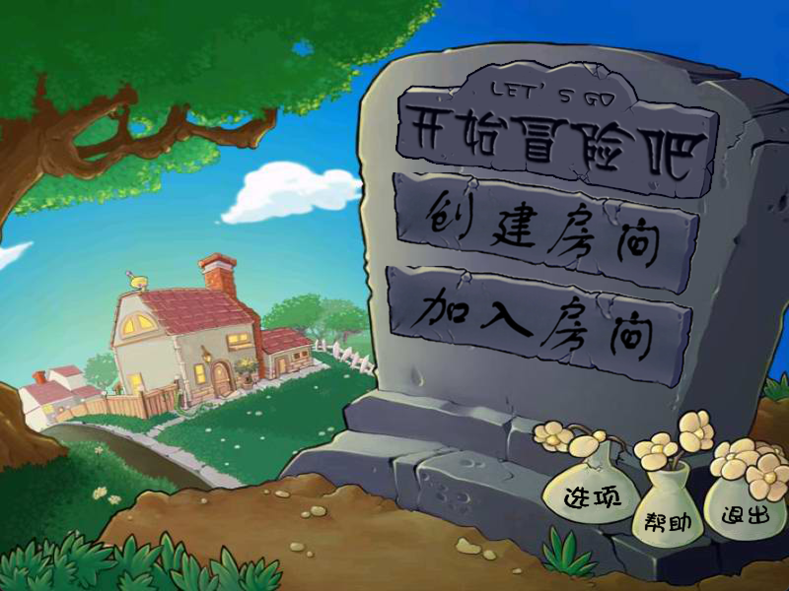

# PZ-VS-ZP

软件工程实验项目

《植物僵尸大战僵尸植物》

## 游戏介绍
《植物僵尸大战僵尸植物》是一款基于植物大战僵尸改编的全新的策略对战游戏，玩家将在这里体验到前所未有的混合战斗玩法。你不仅可以操控经典的植物单位，还能同时指挥僵尸军团。通过精心布置植物和僵尸的组合，打造出强大的混合战队，迎战对方的植物和僵尸阵容。游戏的核心机制是，植物不仅能攻击僵尸，还可以攻击敌方植物，而僵尸则专注于摧毁对方的植物。玩家胜利条件是己方僵尸吃掉对方的脑子即可获胜。

相比于原版的玩法，引入多人对战、协作模式和社交系统，解决了单机塔防的单一性和缺乏实时对战的乐趣，增强了游戏的互动性和可玩性。

- 已经加入的植物：向日葵，豌豆射手，坚果墙，寒冰射手，樱桃炸弹，双发射手，三线射手，大嘴花，小喷菇，土豆雷，地刺，胆小菇，倭瓜，火爆辣椒，阳光菇，寒冰菇，魅惑菇，火炬树桩，睡莲，杨桃，咖啡豆，海蘑菇，高坚果，缠绕水草，毁灭菇，墓碑吞噬者，大喷菇，大蒜，南瓜头，机枪豌豆，荆棘石，双子向日葵，忧郁蘑菇。
- 已经加入的僵尸：普通僵尸，旗帜僵尸，路障僵尸，铁桶僵尸，读报僵尸，橄榄球僵尸，鸭子救生圈僵尸，铁门僵尸，撑杆跳僵尸，冰车僵尸，潜水僵尸。

[僵尸](https://pvz.fandom.com/zh/wiki/%E5%83%B5%E5%B0%B8%EF%BC%88%E7%BB%9F%E7%A7%B0%EF%BC%89)、[植物](https://pvz.fandom.com/zh/wiki/%E6%A4%8D%E7%89%A9)名称参见图鉴

## 游戏规则

## 游戏界面

主界面

选卡界面

多人对战界面

其中从左到右第一个卡槽为可种植植物卡槽，第二个卡槽为可部署僵尸卡槽，第三个卡槽为

## 食用方法

### 联机模式
- 双方玩家必须位于同一局域网下，建议连接同一个手机热点。
- 一名玩家点击 `创建房间` 后（称为 `房主`），另一名玩家（称为 `普通玩家` ）需要在 `30s` 内点击 `加入房间` 。
- 房主的可部署区域在屏幕右侧，普通玩家的可部署区域在屏幕左侧。

## 已知bug
- 铲子可以铲除对方植物（